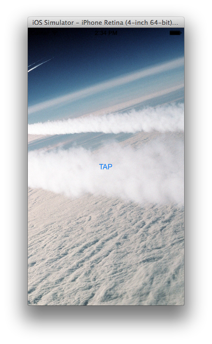
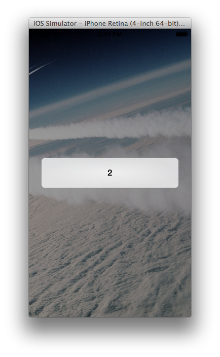

# Single View Test

This is a simple project used to test small pieces of objective-c, cocoa, cocoa touch, and other things in iOS without the need to set up a new XCode project.

## Suggested Use

Put whatever you are testing in its own method and call it from `buttonTapped:` inside `SVTViewController.m`.

```objc
- (IBAction)buttonTapped:(id)sender {
    [self testMethod];
}

- (void)testMethod {
    NSLog(@"%i", 1+1);
}
```

Build and run the project, and tap the `TAP` button to test.



If the results can be viewed as a relatively short string, it is recommended to make use of the `toastWithString:` method.

```objc
- (IBAction)buttonTapped:(id)sender {
    [self testMethod];
}

- (void)testMethod {
    [self toastWithString:[NSString stringWithFormat:@"%i", 1+1]];
}
```


